# Q1:
You should spend about 20 minutes on this task.
The table shows the percentage of journeys made by different forms of transport in four countries,
The bar graph shows the results of a survey into car use in Canada.
Summarise the information by selecting and reporting the main features, and make comparisons
where relevant.
Write at least 150 words.
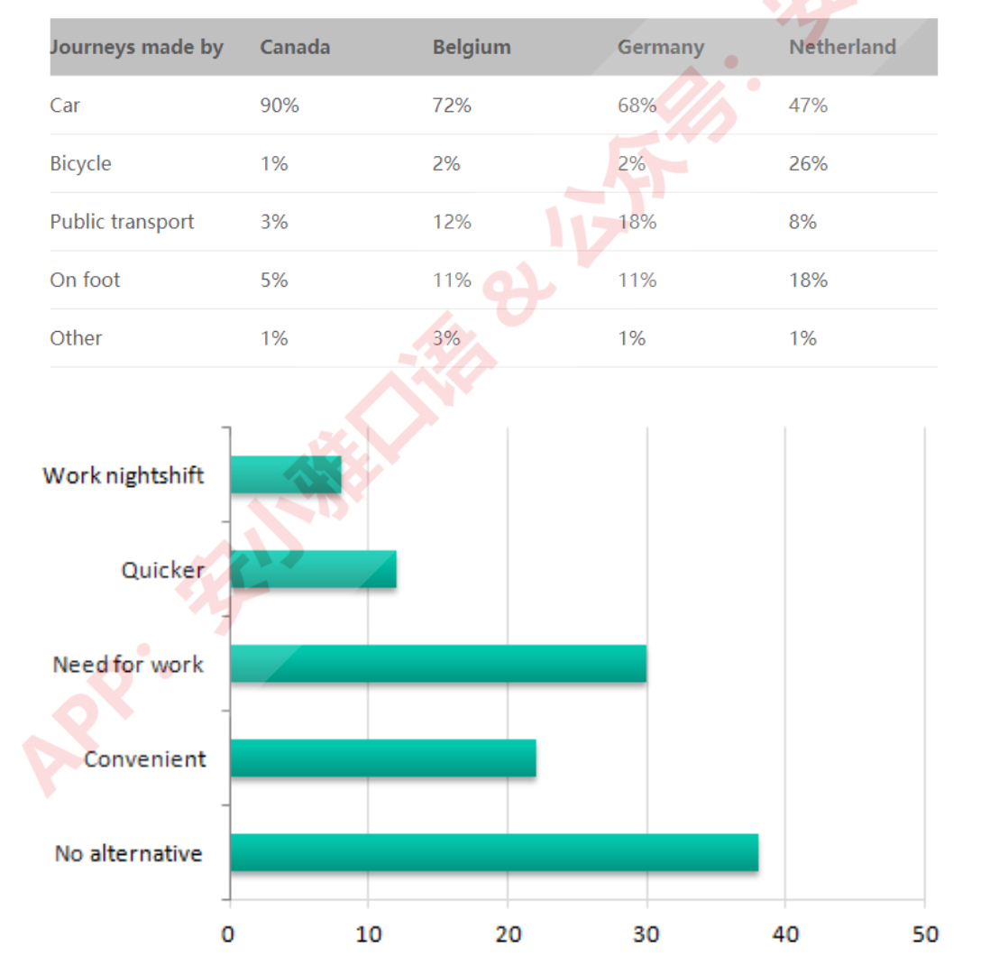

# A1:
Example answer：
The table compares modes of transport used in four countries: Canada, Belgium, Germany and the Netherlands.
The percentage of journeys made by car, bicycle, public transport and on foot is given. The bar chart shows the
results of a survey into reasons people in Canada travel to work by car.
As can be seen from the table, cars are the most frequently used form of transport in all four countries.
However, the proportion of journeys made by car ranges from a low of 47 per cent in the Netherlands to a high
of 90 per cent in Canada. Figures for the other forms of transport also varies considerably. Not surprisingly, in
the Netherlands, a high proportion of trips were made by bicycle (26%) and on foot (18%). The highest rate of
public transport use is in Germany, where nearly one in five journeys is made by public transport.
The bar chart provides information that may help explain why car use in Canada. The most frequently cited
reason is lack of any other alternative (38%). Although a sizable percentage says it is more convenient (22%),
the other listed factors appear to relate more to need than preference, e.g. working night shift.
Overall, the figures show considerable variation in modes of transport used, though the car continues to
dominate in most contexts.
(223 words)

# Q2:
You should spend about 20 minutes on this task.
The pie charts below show how dangerous waste products are dealt with in three countries.
Summarise the information by selecting and reporting the main features, and make comparisons
where relevant.
Write at least 150 words.
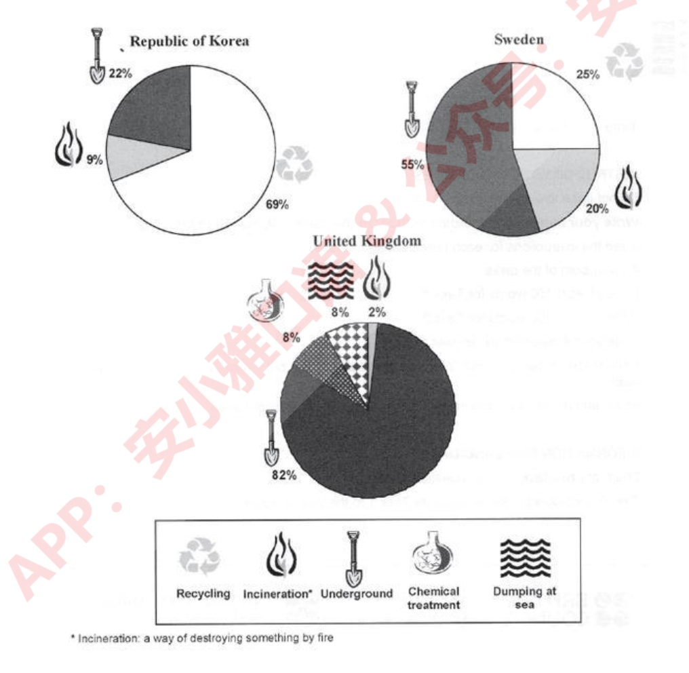

# A2:
Example answer：
The charts compare three countries in terms of the methods they use to treat hazardous waste products.
Overall, recycling is the most widely-used approach to treating hazardous waste in Korea, in contrast to
Sweden and the UK which rely mainly on landfills. Furthermore, the United Kingdom employs a more varied
set of waste handling schemes.
In Korea, the most significant share of dangerous waste (69%) is recycled. The second highest proportion, 22%,
is buried underground while less than half this figure is incinerated.
Sweden, on the other hand, favours landfills over the other two approaches since more than half of all
dangerous waste is buried underground. There is little difference between the shares of recycling and burning,
as the former accounts for 25% whereas the share of the latter is lower by a margin of 5%.
The most popular method in the United Kingdom, like in Sweden, is burying which contributes 82%. The UK
also dumps 8% of its waste at sea while treating a similar proportion with chemicals to render it harmless.
Incineration is responsible for a mere 2%.
(180 words)

# Q3:
You should spend about 20 minutes on this task.
The charts below give information about world spending and population.
Summarise the information by selecting and reporting the main features, and make comparisons
where relevant.
Write at least 150 words.
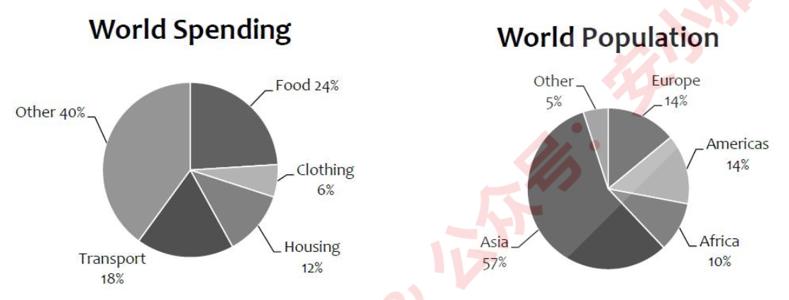

# A3:
Example answer：
The pie charts compare the shares of four major items in global expenditure, as well as how global population
is distributed.
Overall, the largest proportion of money in the world is allocated to food, while transport, housing and clothing
are other significant items. Moreover, the population of Asia is responsible for the largest group of humans.
According to the first chart, the most significant amounts are paid for food (almost a quarter of global
expenditure) and transport (almost 20%), while housing also accounts for a considerable proportion. The least
among the four is spent on clothing (merely 6 percent) and the remaining 40% is spent on a variety of other
items.
The second chart shows that there is a significant difference between the population of Asia and that of other
continents since approximately 3 out of every 5 human beings live in Asia. Europe and the Americas share
similar proportions and together are host to roughly one-third of the world’s population, while the inhabitants
of Africa form a mere one-tenth.
(170 words)

# Q4:
You should spend about 20 minutes on this task.
The chart below shows the amount spent on six consumer goods in four European countries.
Summarise the information by selecting and reporting the main features, and make comparisons
where relevant.
Write at least 150 words.
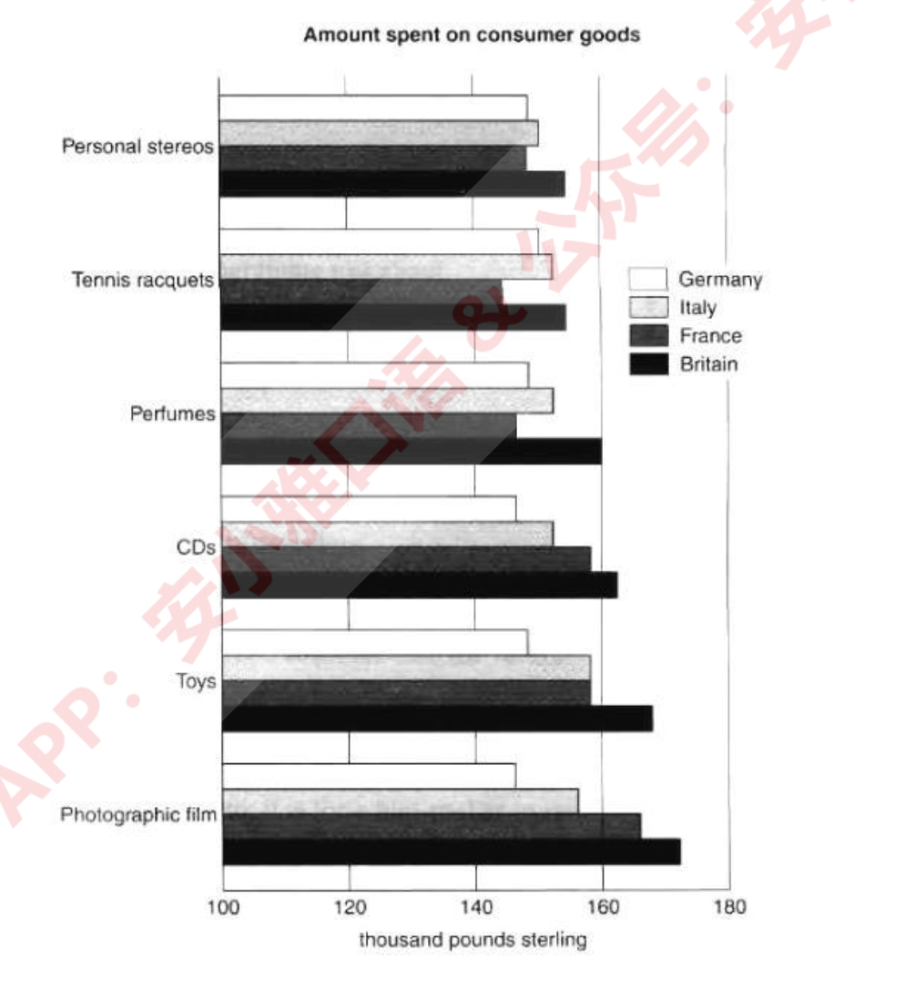

# A4:
Example answer：
The diagram compares how much money was spent on six different products in Germany, Italy, France and
Britain.
Overall, more money was spent on toys and photographic film than on any other product. Also, the British
were the biggest spenders in all six categories among the nations compared in the bar chart, while the lowest
spending levels were attributed to German consumers.
In Britain, the highest amount of money was spent on photographic film (more than 170 million pounds), while
similar amounts were spent on personal stereos and tennis racquets which together ranked last.
The French spent the second highest amount of money among the four nations on compact disks, toys and
photographic film, while they ranked last in personal stereos, tennis racquets and colognes.
Italian consumers spent more money on toys than on any other product (a bit less than £160 million), but they
also paid a lot for photographic film.
Finally, Germans spent the least overall, having similar spending figures for all 6 products compared in the
chart.
(170 words)

# Q5:
You should spend about 20 minutes on this task.
The graph below shows the consumption of fish and some different kinds of meat in a European
country between 1979 and 2004.
Summarise the information by selecting and reporting the main features, and make comparisons
where relevant.
Write at least 150 words.
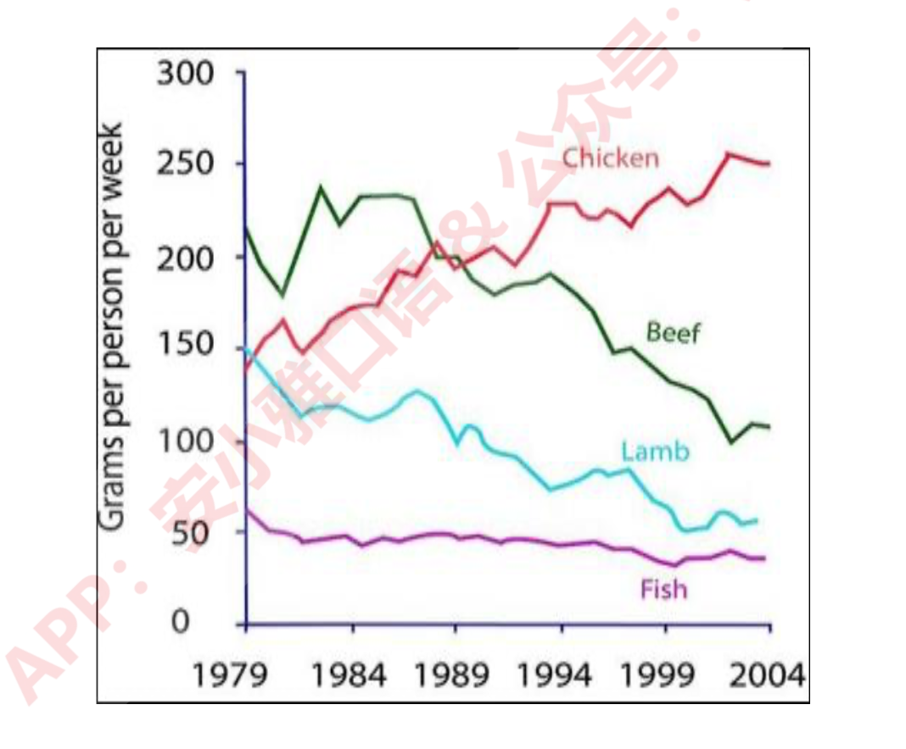

# A5:
Example answer：
The diagram compares changes in consumption figures for different kinds of meat and fish in a country in
Europe from 1979 to 2004. Overall, although beef was initially the most popular type of meat, it was overtaken
by chicken towards the end of the survey. In contrast, the figure for fish remained the least significant
throughout the period.
In the first year, beef had a consumption of about 225 grams per person per week, after which it experienced a
sudden drop of 50 before increasing to about 230 in 1984. There were small fluctuations until 1989, which was
followed by a dramatic decrease to around half as high as its original level in 2004.
The figure for lamb was initially almost as high as that for chicken (around 150 grams). However, while the
former declined gradually as it reached approximately 60 in the last year, the latter saw a considerable growth
and outstripped beef consumption in 1989, peaking at 250 in 2004.
Fish consumption was originally approximately 60 grams and experienced a small fall of about 10 over the
period.
(180 words)

# Q6:
You should spend about 20 minutes on this task.
The graph below gives information about Dubai gold sales in 2002.
Summarise the information by selecting and reporting the main features, and make comparisons
where relevant.
Write at least 150 words.
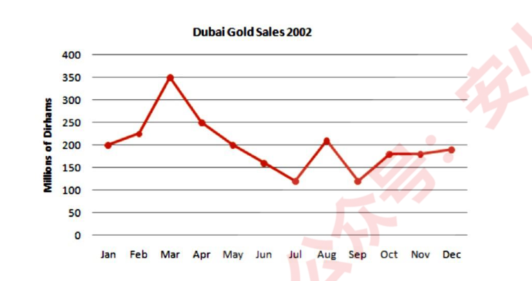

# A6:
Example answer：
The diagram illustrates how gold sales in Dubai changed from January to December 2002.
Overall, the figure fluctuated widely before returning to its original level at the end of the year. Besides, gold
sales were at their highest in March, while the weakest figures could be observed in July and September.
In the first month of 2002, the figure stood at 200 million dirhams and rose slightly to reach about 225 million
in February. This was followed by another increase, although much steeper, in March when sales hit 350
million. However, this upward trend was suddenly broken and sales declined dramatically over the next 4
months to reach a little over 100 million in July. August sales saw a significant rise back to January levels as
the figure nearly doubled, but it dropped again in September to the same level as it was in July. There was a
small increase of about 100 million dirhams in October, after which the figure levelled off and remained
relatively unchanged over the last two months of 2002.
(174 words)

# Q7:
You should spend about 20 minutes on this task.
The tables below give information about sales of Fairtrade*-labelled coffee and bananas in 1999
and 2004 in five European countries.
Summarise the information by selecting and reporting the main features, and make comparisons
where relevant.
Write at least 150 words.
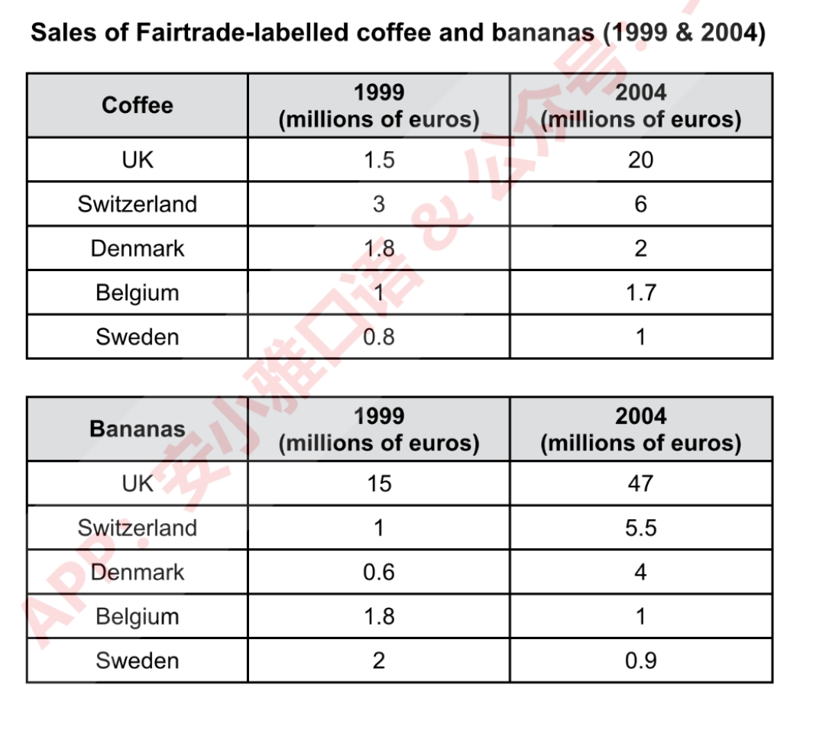

# A7:
Example answers：
The tables show how fair-trade coffee and banana sales changed in five countries in 2004 compared to 1999.
Overall, Coffee sales rose in all countries with the highest sales observed in the UK. Banana sales also rose in
all but two countries, and were highest in the UK.
In 1999, the most significant coffee sales, 3 million (3m) euros were reported in Switzerland, and they doubled
in 2004. The figure for the UK was originally 50% lower than that for Switzerland (1.5m) while sales in
Denmark were slightly higher (1.8m). However, while the former rose dramatically to 20m, the latter remained
relatively stable. There was little difference between the figures for Belgium (1m) and Sweden (0.8m), and
both experienced noticeable increases to 1.7m and 1m, respectively.
UK had the highest banana sales in both years, as they rose over threefold from 15 million euros to 47m. Swiss
sales were originally almost twice as high as those of Denmark (1 and 0.6m, respectively), and both surged,
reaching 5.5 and 4m. There was little difference between the figures for Sweden and Belgium (2 and 1.8m,
respectively), and both nearly halved to reach about 1m in 2004.
(193 words)

# Q8:
You should spend about 20 minutes on this task.
The table shows the average length of YouTube video advertisements and average length of time
viewers spend watching them. Summarise the information by selecting and reporting the main
features.
Write at least 150 words.
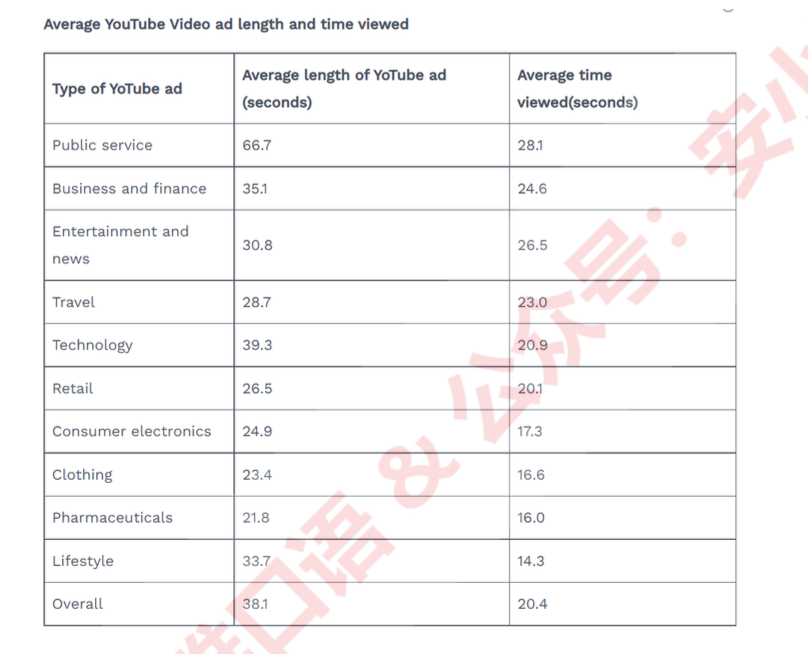

# A8:
The table shows the average length of YouTube video advertisements by sector and average length of time
viewers spent watching these advertisements.
The average length of the advertisements varied from a low of 21.8 seconds for pharmaceuticals to a high of
66.7 for public service advertisements. With the exception of government- and technology- related
advertisements, in general, products and services which required a large financial commitment tended to have
longer advertisements. Entertainments, financial services and travel advertisements, for example, were all
twenty eight seconds on average or longer. Less expensive products, on the other hand, such as consumer
electronics, clothing and medicines, tended to have shorter advertisements.
Adverts for more expensive products or services also tended to be watched for longer than adverts for less
expensive items. Viewers on average watched more than 50 per cent of advertisements for entertainment, travel,
business and finance. In contrast, viewers tended to watch less of government advertisements and
advertisements for cheaper goods such as consumer electronics, clothing and medicines.
Overall, length of YouTube video advertisements and length of time spent viewing such advertisements appears
to be associated with the perceived cost of the product or service being advertised.

# Q9:
You should spend about 20 minutes on this task.
The map below is of the town of Garlsdon and shows two possible sites for a new supermarket.
Summarise the information by selecting and reporting the main features, and make comparisons
where relevant.
Write at least 150 words.
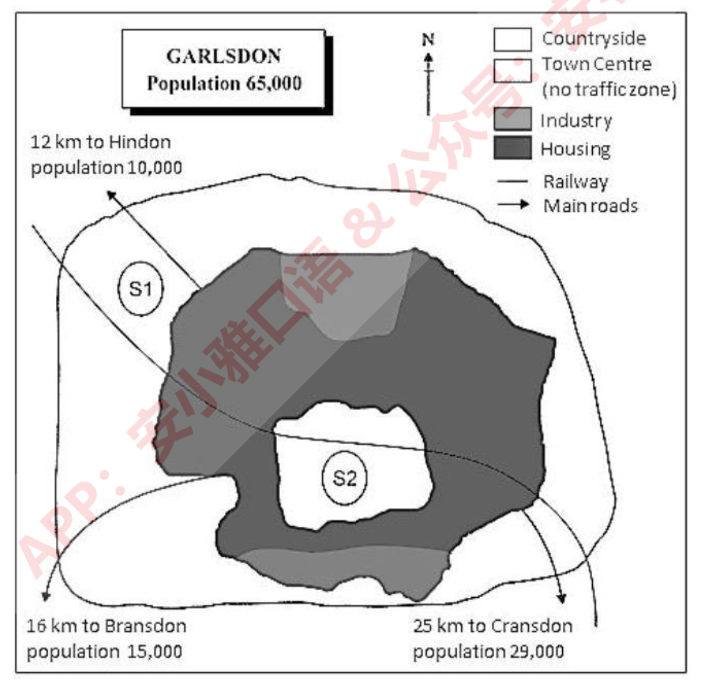

# A9:
Example answer：
The map shows two proposed locations for a new supermarket for the town of Garlsdon. Overall, neither site is
appropriate for all the towns, but for customers in Cransdon, Hindon and Garlsdon, the out-of-town site (S1)
would probably offer more advantages.
The first potential location (S1) is outside the town itself, and is sited just off the main road to the town of
Hindon, lying 12 kilometres to the north-west. This site is in the countryside and so would be able to
accommodate a lot of car parking. This would make it accessible to shoppers from both Hindon and Garlsdon
who could travel by car. Since it is also close to the railway line linking the two towns to Cransdon (25 km to
the south-east), a potentially large number of shoppers would also be able to travel by train.
In contrast, the suggested location, S2, is right in the town centre, which would be good for local residents.
Theoretically the store could be accessed by road or rail from the surrounding towns, including Bransdon, but
as the central area is a no-traffic zone, cars would be unable to park and access would be difficult.
(194 words)

# Q10:
You should spend about 20 minutes on this task.
The two maps below show an island, before and after the construction of some tourist facilities.
Summarise the information by selecting and reporting the main features, and make comparisons
where relevant.
Write at least 150 words.
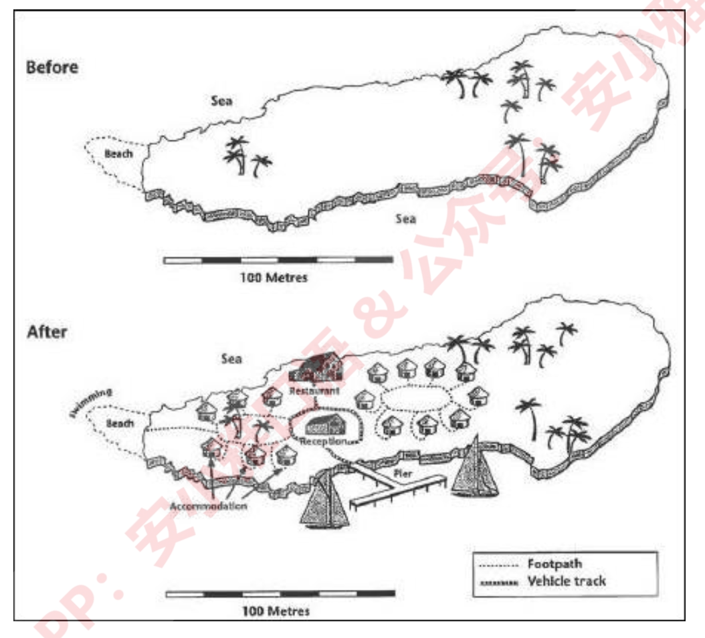

# A10:
Example answer：
The maps illustrate how an island has changed following the development of various facilities for visitors.
Overall, there have been significant constructions in the island in terms of accommodation and facilities for
tourists. It is noteworthy that these developments have occurred without any noticeable damage to the trees.
The length of the island is over 1200 metres while its width varies from about 200 to 500 metres in different
places. Originally, there was a beach to the left of the island, and the eastern and western parts were covered
with woodland, apart from which the island was completely bare.
In comparison, swimming facilities have now been built in the beach. Furthermore, the western woodland is
surrounded by a series of huts which are connected to each other and to the beach via footpaths. There is also a
restaurant in northern part which is connected to a reception building in the middle of the island as well as a
new pier to the south by means of a vehicle track. Finally, a larger set of huts have been constructed between
the reception and the eastern woodland.
(185 words)

# Q11:
You should spend about 20 minutes on this task.
The diagram below shows the process by which bricks are manufactured for the building industry.
Summarise the information by selecting and reporting the main features, and make comparisons
where relevant.
Write at least 150 words.
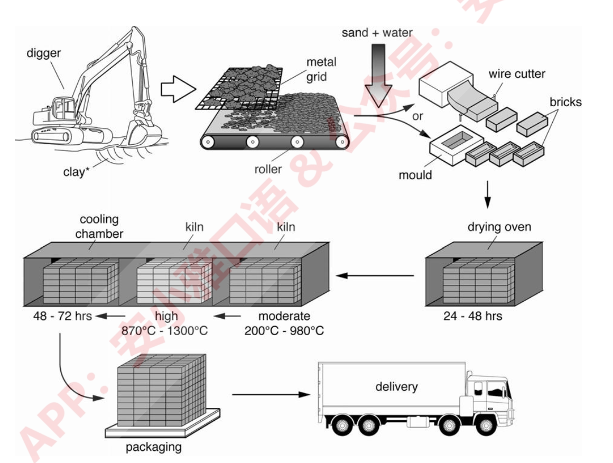

# A11:
Example answer：
The picture illustrates how bricks are produced.
The process begins when clay is dug out through the use of a digger, which is followed by clay passing through
a metal grid. Fine clay is then carried by a roller after which sand and water are added to it. In the next stage,
either this mixture is pressed through a frame and cut into bricks using a wire cutter, or it is put into moulds and
formed into bricks. Following that, the bricks are dried in a drying oven for one to two days. The next three
stages involve two kilns connected to a cooling chamber. The dried bricks are first heated from 200 to 980
degrees centigrade, before being exposed to high temperature (870 to 1300 degrees). They are then cooled
within 48 to 72 hours. Eventually, they are packed and delivered to customers by trucks.
Overall, the procedure of producing bricks is comprised of ten stages which are rather simple.
(161 words)

# Q12:
You should spend about 20 minutes on this task.
The diagram below shows the life cycle of the honey bee.
Summarise the information by selecting and reporting the main features, and make comparisons
where relevant.
Write at least 150 words.
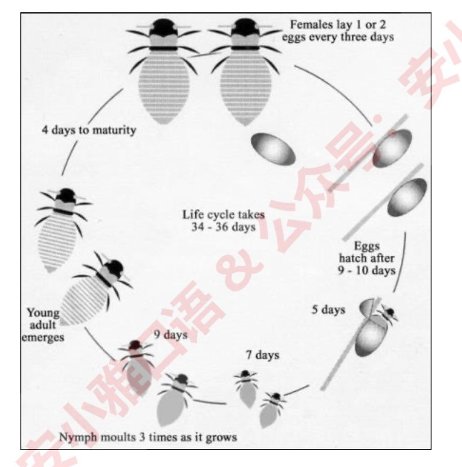

# A12:
Example answer：
The chart illustrates the stages in the life of honey bees. It takes approximately five weeks (34 to 36 days to be
exact) to complete. All in all, this life cycle is comprised of six stages from eggs to fully mature bees.
The first stage is when the female bee lays up to a couple of oval eggs once every 72 hours. These eggs hatch
between nine and ten days later, and immature bees, called nymphs, emerge which lack the typical bee stripes.
Over the next 3 weeks nymphs experience three moulting stages, that is, they shed their skins to allow further
growth to occur: The first moulting happening 5 days after the eggs hatch, a week after which the second one
takes place. Nine days later nymphs moult for a third time and young adult honey bees emerge, identified by
their horizontally striped backs. These take four more days to mature into larger adult bees whose backs are
marked with bolder and darker stripes, and the cycle starts over again.
(171 words)

# Q13:
You should spend about 20 minutes on this task.
The diagram below shows how geothermal energy is used to produce electricity.
Summarise the information by selecting and reporting the main features, and make comparisons
where relevant.
Write at least 150 words.
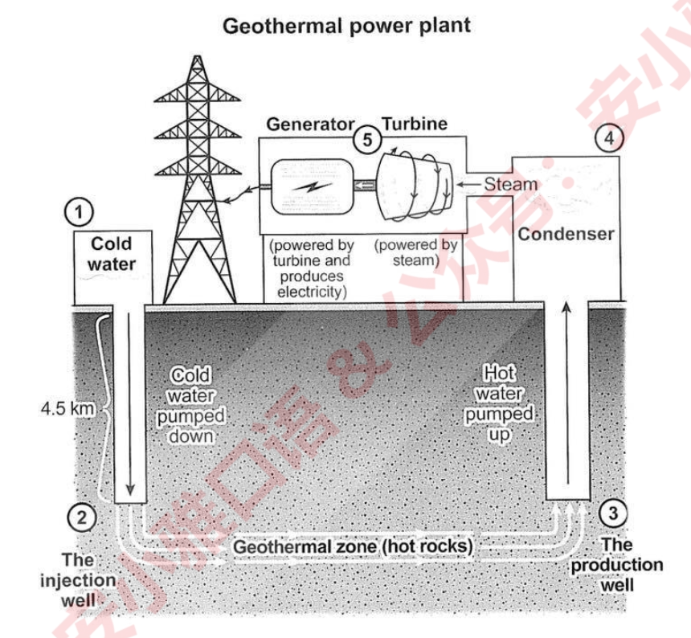

# A13:
The diagram shows that there are five main stages in the production of electricity through the use of geothermal
energy.
The process begins with cold water being pumped from the surface of the earth down into a 4.5 kilometer-deep
injection well. From there, it is transferred to the geothermal zone, a subterranean region composed of hot
rocks, before reaching the production well, which is a vertical pipe similar to the injection well but a bit wider.
In the stage that follows, the hot water is pumped up through the production well into a condenser on the
surface where it is converted into steam, following which it is used to power a turbine and rotate it. This turbine
is connected to an electricity generator which, when rotated by the turbine, produces electricity. The process
ends when the electricity generated by the generator is transferred to the power grid for consumption by end
users.
(152 words)